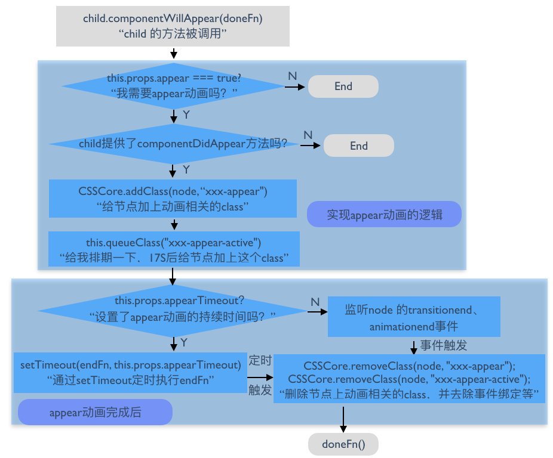

#ReactCSSTransitionGroup
[知乎专栏pure render参考引用](https://zhuanlan.zhihu.com/p/20419592)
[react官方文档参考引用](https://facebook.github.io/react/docs/animation.html)

>**Note:**
>**You must provide the key attribute for all children of ReactCSSTransitionGroup, even when only rendering a single item. This is how React will determine which children have entered, left, or stayed.**

      //使用ReactCSSTransitionGroup生成的react dom结构
      <ReactCSSTransitionGroup>
        <ReactTransitionGroup>
          <ReactCSSTransitionGroupChild>
            ...
          <ReactCSSTransitionGroupChild />
          <ReactCSSTransitionGroupChild>
            ...
          <ReactCSSTransitionGroupChild />
          ....
        <ReactTransitionGroup />
      <ReactCSSTransitionGroup />

>1.ReactTransitionEvents 提供了对各种前缀的 transitionend、animationend 事件的绑定和解绑工具

>2.ReactTransitionChildMapping 提供了对 ReactTransitionGroup 这个 component 的 children 进行格式化的工具

>3.ReactCSSTransitionGroup 会调用 ReactCSSTransitionGroupChild 对 children 中的每个元素进行包装，然后将包装后的 children 作为 ReactTransitionGroup 的 children 。

**ReactTransitionGroup 和 ReactCSSTransitionGroupChild 才是实现动画的关键部分**

>###引入模块
>       import ReactCSSTransitionGroup from 'react-addons-css-transition-group';
>       
>###使用
> 当新的节点从 `ReactCSSTransitionGroup` 中删除时，这个节点会被加上 `example-leave` 的 class，在下一帧中这个节点还会被加上 `example-leave-active` 的 class

    app.js
      return (
        

          <button onClick={this.handleAdd}>Add Item</button>
          <ReactCSSTransitionGroup 
            transitionName="example"        //class名
            //transitionEnter={false}  禁止开始动画阶段
            transitionEnterTimeout={1000}   //开始动画时长  it will get the example-enter CSS class and the example-enter-active CSS class added in the next tick. 
            transitionLeaveTimeout= 300     //结束动画时长 it will get the example-leave CSS class and the example-leave-active CSS class added in the next tick. 
            transitionAppear={true}         //初始化组件过渡阶段是否开启 it will get the example-appear CSS class and the example-appear-active CSS class added in the next tick. leave
            transitionAppearTimeout={500}>  //初始化组件过度阶段时长
            {items}
          </ReactCSSTransitionGroup>
        

      );

>自定义各个阶段样式
    
      <ReactCSSTransitionGroup
        transitionName={ {
          enter: 'enter',
          enterActive: 'enterActive',
          leave: 'leave',
          leaveActive: 'leaveActive',
          appear: 'appear',
          appearActive: 'appearActive'
        } }>
        {item}
      </ReactCSSTransitionGroup>

      <ReactCSSTransitionGroup
        transitionName={ {
          enter: 'enter',   //默认enterActive使用样式enter-active
          leave: 'leave',   //默认enterActive使用样式enter-leave
          appear: 'appear'  //默认enterActive使用样式enter-appear
        } }>
        {item2}
      </ReactCSSTransitionGroup>

          app.css
          .example-enter {
              opacity: 0.01;
              transition: opacity .5s ease-in;
            }
            .example-enter.example-enter-active {
              opacity: 1;
            }
            .example-leave {
              opacity: 1;
              transition: opacity .5s ease-in;
            }
            .example-leave.example-leave-active {
              opacity: 0.01;
            }

[底层实现ReactTransitionGroup](./ReactTransitionGroup.md)

