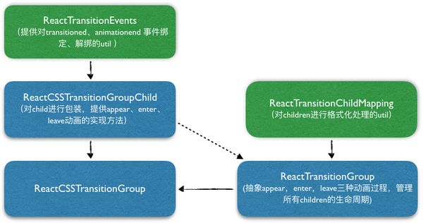

#ReactCSSTransitionGroup
[参考引用](https://zhuanlan.zhihu.com/p/20419592)

>1.ReactTransitionEvents 提供了对各种前缀的 transitionend、animationend 事件的绑定和解绑工具

>2.ReactTransitionChildMapping 提供了对 ReactTransitionGroup 这个 component 的 children 进行格式化的工具

>3.ReactCSSTransitionGroup 会调用 ReactCSSTransitionGroupChild 对 children 中的每个元素进行包装，然后将包装后的 children 作为 ReactTransitionGroup 的 children 。

**ReactTransitionGroup 和 ReactCSSTransitionGroupChild 才是实现动画的关键部分**

>###引入模块
>       import ReactCSSTransitionGroup from 'react-addons-css-transition-group';
>       
>###使用
> 当新的节点从 `ReactCSSTransitionGroup` 中删除时，这个节点会被加上 `example-leave` 的 class，在下一帧中这个节点还会被加上 `example-leave-active` 的 class
        app.js
        return (
            

              <button onClick={this.handleAdd}>Add Item</button>
              <ReactCSSTransitionGroup transitionName="example">
                {items}
              </ReactCSSTransitionGroup>
            

          );

          app.css
          .example-enter {
              opacity: 0.01;
              transition: opacity .5s ease-in;
            }
            .example-enter.example-enter-active {
              opacity: 1;
            }
            .example-leave {
              opacity: 1;
              transition: opacity .5s ease-in;
            }
            .example-leave.example-leave-active {
              opacity: 0.01;
            }

