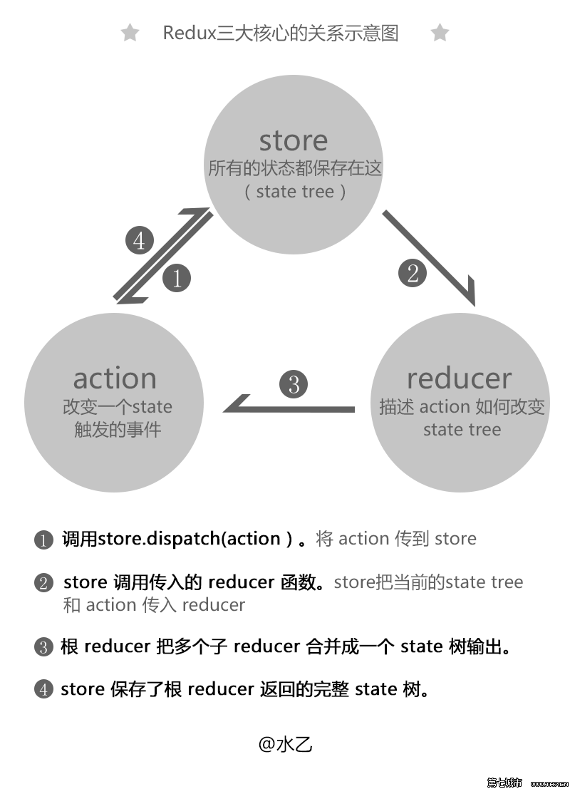
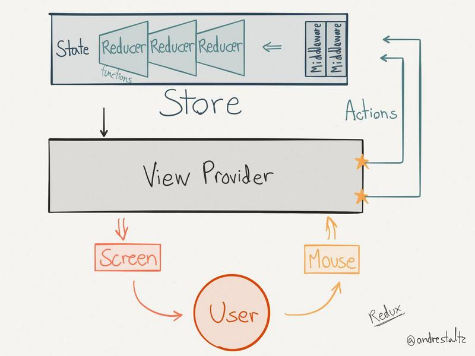

[redux中文文档](http://camsong.github.io/redux-in-chinese/index.html)

[redux tutorial](https://github.com/react-guide/redux-tutorial-cn)

[redux实战参考](http://bluereader.org/article/89427686)

[redux参考理解1](https://segmentfault.com/a/1190000004208610)

#redux

>##Action
> **作用：`Actions` 是把数据从应用传到 `store` 的有效载荷。它是 `store` 数据的唯一来源。用法是通过 `store.dispatch() `把 `action` 传到 `store`。**
> 
> 1.用Action来分辨具体的执行动作。比如是create 还是delete？或者是update？
> 2.操作数据首先得有数据。比如添加数据得有数据，删除数据得有ID。。action就是存这些数据的地方。

>##Reducer
> **`Action` 只是描述了有事情发生了这一事实，并没有指明应用如何更新 `state`。这是 `reducer` 要做的事情。**
>
>##Store
> **一个应用只有一个`Store`**
> 
> 1.维持应用的 state；
> 2.提供 getState() 方法获取 state；
> 3.提供 dispatch(action) 方法更新 state；
> 4.通过 subscribe(listener) 注册监听器。

>##使用步骤
> 1. 创建actionCreator
> 2. 创建reducer

###创建actionCreator(action.js)

        var actionCreator = function() {
            pretty obvious now) and returns it
            return {
                type: 'AN_ACTION'
            }
        }

###创建reducer(reducer.js)

        let todoReducer = function (state = [], action) {
            switch (action.type) {
                case 'add_todo' : 
                    return state.slice(0).concat({
                        text: action.text,
                        completed: false
                    });
                    break;
                default:
                    return state;
            }
        }

###创建store(store.js)

        var store = Redux.createStore(todoReducer);

###创建component(component.js)

        let App = React.createClass({
            getInitialState : function () {
                return {
                    items : store.getState()
                }   
            },
            componentDidMount : function () {
                let unsubscribe = store.subscribe(this.onChange);
            },
            onChange : function () {
                this.setState({
                    item: store.getState()
                });
            },
            handleAdd : function () {
                let input = ReactDOM.findDOMNode(this.refs.todo);
                let value = input.value.trim();
                if (value) {
                    store.dispatch(addTodoActions(value));
                }
                input.value = '';
            },
            render : function () {
                return (
                    

                        <input ref="todo" type="text" placeholder='please input' style={{marginRight:'10px'}} />
                        <button onClick={this.handleAdd}>add button</button>
                        <ul>
                            {this.state.items.map(function(item){
                                return <li>{item.text}</li>;
                            })}
                        </ul>
                    
          
                )
            }
        });