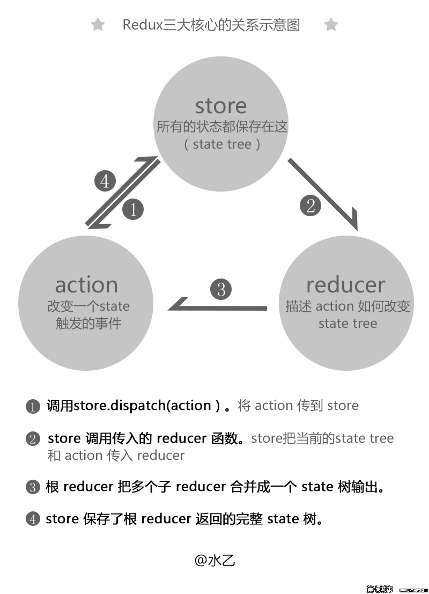

#总结

[参考](http://cn.redux.js.org/docs/recipes/ReducingBoilerplate.html)
[项目生产代码参考](http://cn.redux.js.org/docs/recipes/index.html)
[参考1](http://www.tuicool.com/articles/vEnMFzz)

>###action
>是store的**唯一**数据来源, 可以通过store.dispatch()将action传到store，并出发reducer
        
        const ADD_TODO = 'ADD_TODO';
        {
          type: ADD_TODO,
          text: 'Build my first Redux app'
        }

>每个action返回的实质是一个对象，在对象的属性中应含有需要更新的state数据
>若返回的action不是一个对象，则需借助中间件，并在异步action中手动调用dispatch(action)触发相应的reducer
        
        export function loadPosts(userId) {
          return {
            // 要在之前和之后发送的 action types
            types: ['LOAD_POSTS_REQUEST', 'LOAD_POSTS_SUCCESS', 'LOAD_POSTS_FAILURE'],
            // 检查缓存 (可选):
            shouldCallAPI: (state) => !state.users[userId],
            // 进行取：
            callAPI: () => fetch(`http://myapi.com/users/${userId}/posts`),
            // 在 actions 的开始和结束注入的参数
            payload: { userId }
          };
        }

        function callAPIMiddleware({ dispatch, getState }) {
          return function (next) {
            return function (action) {
              const {
                types,
                callAPI,
                shouldCallAPI = () => true,
                payload = {}
              } = action;
              if (!types) {
                // 普通 action：传递
                return next(action);
              }
              if (
                !Array.isArray(types) ||
                types.length !== 3 ||
                !types.every(type => typeof type === 'string')
              ) {
                throw new Error('Expected an array of three string types.');
              }
              if (typeof callAPI !== 'function') {
                throw new Error('Expected fetch to be a function.');
              }
              if (!shouldCallAPI(getState())) {
                return;
              }
              const [requestType, successType, failureType] = types;
              dispatch(Object.assign({}, payload, {
                type: requestType
              }));
              return callAPI().then(
                response => dispatch(Object.assign({}, payload, {
                  response: response,
                  type: successType
                })),
                error => dispatch(Object.assign({}, payload, {
                  error: error,
                  type: failureType
                }))
              );
            };
          };
        }

>###reducer
>更新store中的state

        import { combineReducers } from 'redux';
        function visibilityFilter(state = SHOW_ALL, action) {
          switch (action.type) {
            case SET_VISIBILITY_FILTER:
              return action.filter;         
            default:
              return state;
          }
        }
        function todos(state = [], action) {
          switch (action.type) {
            case ADD_TODO:
              return [...state, {
                text: action.text,
                completed: false
              }];
            case COMPLETE_TODO:
              return [
                ...state.slice(0, action.index),
                Object.assign({}, state[action.index], {
                  completed: true
                }),
                ...state.slice(action.index + 1)
              ];
            default:
              return state;
          }
        }
        const todoApp = combineReducers({
          visibilityFilter,
          todos
        });
        export default todoApp;

        var reducers = {
          todos: (state, action) { //预期此处的 state 参数是全局 state.todos 属性
            switch (action.type) {...} //返回的 new state 更新到全局 state.todos 属性中
          },
          activeFilter: (state, action) { //预期拿到 state.activeFilter 作为此处的 state
            switch (action.type) {...} //new state 更新到全局 state.activeFilter 属性中
          }
        }
        //返回一个 rootReducer 函数
        //在内部将 reducers.todos 函数的返回值，挂到 state.todos 中
        //在内部将 reducers.activeFilter 函数的返回值，挂到 state.activeFilter 中
        var rootReducer = combineReducers(reducers)

>store下的state正是reducer每一个处理后最终返回数据

>###store
>1.维持应用的 state；
>2.提供 getState() 方法获取 state；
>3.提供 dispatch(action) 方法更新 state；
>4.通过 subscribe(listener) 注册监听器。

        import { createStore } from 'redux'
        import todoApp from './reducers'
        let store = createStore(todoApp)

[完整代码](./demo/demoRedux/TodoList)